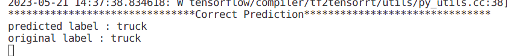
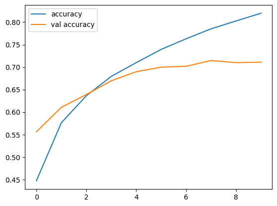
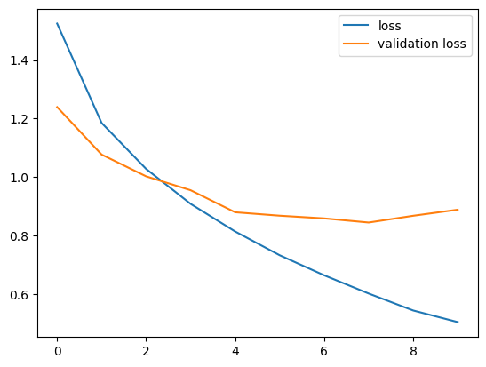

# Classification on cifar10 dataset

This is a simple project of image classification. I trained my CNN model with cifar10 dataset using `GPU T4 x2` from kaggle. You can check my kaggel notebook [here](https://www.kaggle.com/code/kavyas1996/cnn-cifar10-classification). My model has top1 accuracy of 71% and top5 accuracy of 97%. `src/models/` contains my trained model.

## Try the Implementations Yourself!

As my model is not perfect it'll make faulty predictions sometimes. If you want better classificatio model you can check this [repo](https://www.github.com/kavysabu1996/ViT).

### Requirements
- numpy, tensorflow

You can try my Classification model(pretrained models) by using following code
```
# in repo's root directory
python3 run.py --idx image_idx
```
- image_idx : cifar10 contains 10000 test samples. So you can choose any integer between 0 and 9999.

**example**
```
python3 run.py --idx 45
```
**output**



## Accuray and Loss 

<div>
  
  
</div>

